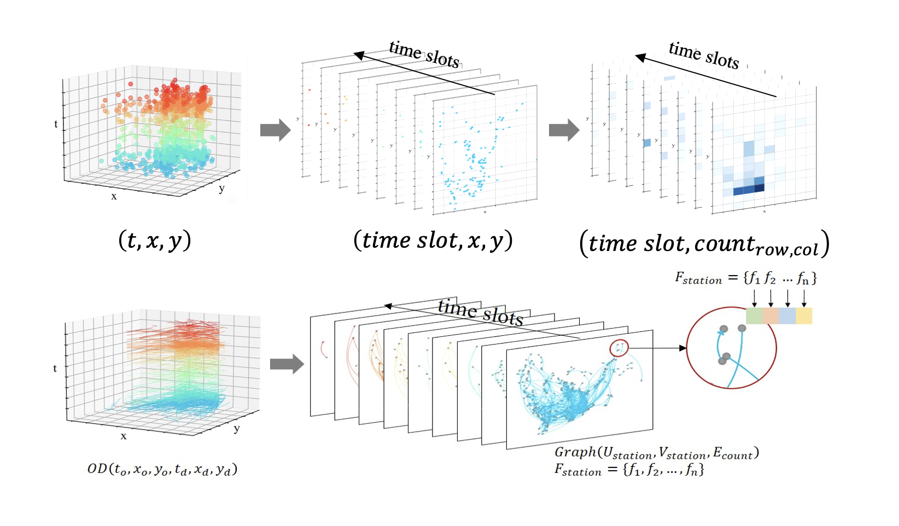
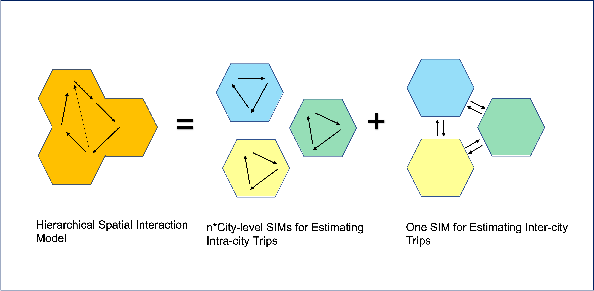
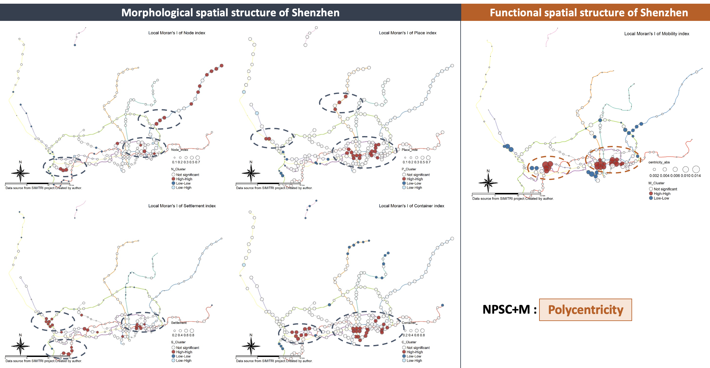
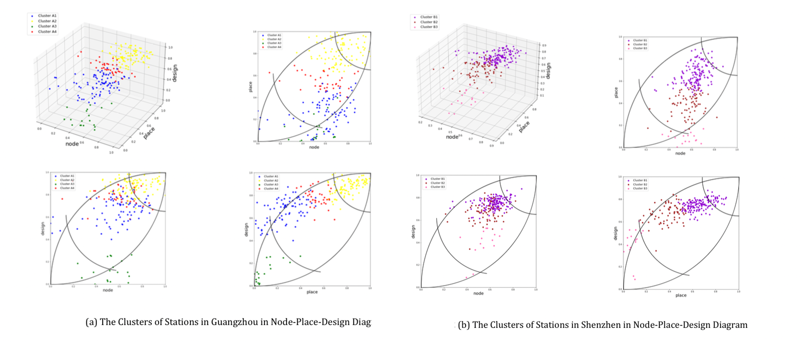

---

How activity pattern associates with income status? Evidence from transit smart card data and AI methods

Qi-Li Gao; Chen Zhong; Yang Yue

Keywords: social inequality, socioeconomic status, activity pattern, smart card data, AI.

[link to abstract](publications/ECTQG_abstract_qiligao.pdf)

---

A Novel Regionalisation Algorithm for Redrawing Cities’ Functional Boundary within Mega-city Region

Bowen Zhang; Chen Zhong; Qili Gao

Keywords: urban movements, cell phone data, spatial interaction model, community detection, mega
city-region

[link to abstract](publications/ECTQG_abstract_bowenzhang.pdf)

---

Measuring the Polycentricity based on urban and intercity transportation networks in Greater Bay Area: a cross-scale method in the context of Node-Place model

Haocheng Sun; Michael Batty; Chen Zhong

Keywords: GBA, Spatial Structure, Morphological Polycentricity, Functional Polycentricity, Node- Place Model

[link to abstract](publications/ECTQG_abstract_haocheng Sun.pdf)

---

The Comparative Study of TOD in Metro Station Areas of Guangzhou and Shenzhen Using an Extended Node-Place Model

Yongxin Yang;

Keywords: transit-oriented development, node-place-design model, urban vibrancy, metro station areas

[link to abstract](publications/ECTQG_abstract_yongxin Yang.pdf)

---

### Latest Blog Posts

<ul class="posts">
  
    <li>{{ post.date | date_to_string }} &raquo; <a href="{{ site.baseurl }}{{ post.url }}">{{ post.title }}</a></li>
  
</ul>
