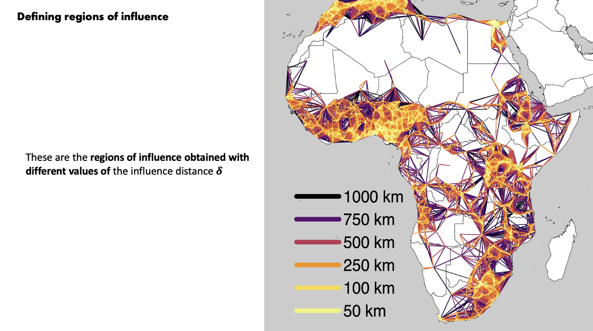
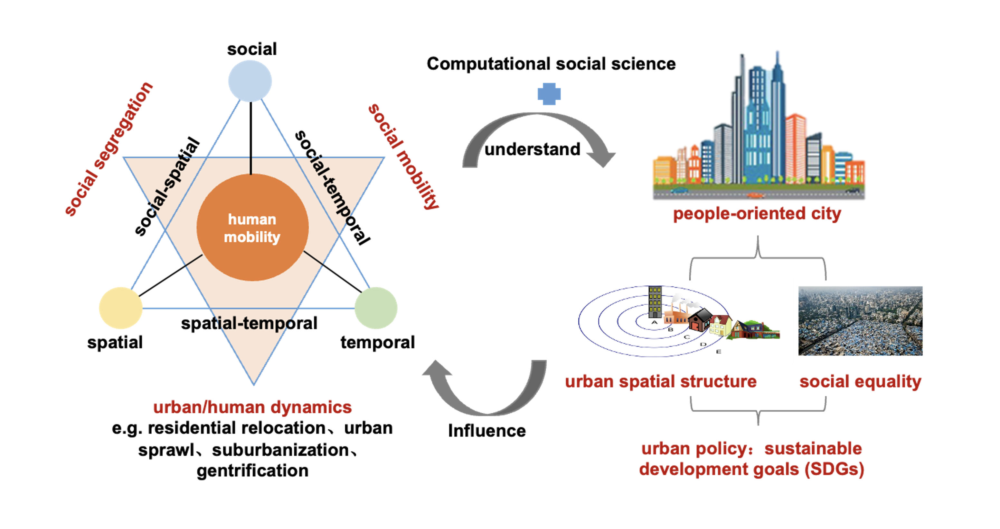

---

[European Colloquium on Theoretical and Quantitative Geography, ECTQG2021](https://ectqg2021.wordpress.com/)

Title: How activity pattern associates with income status? Evidence from transit smart card data and AI methods

Qi-Li Gao; Chen Zhong; Yang Yue

Keywords: social inequality, socioeconomic status, activity pattern, smart card data, AI.

[link to abstract](https://github.com/c-zhong-ucl-ac-uk/realTRIPS/blob/3d0102f56a1419293f3994d03dd192c975683d5f/publications/ECTQG_abstract_qiligao.pdf)

---

[European Colloquium on Theoretical and Quantitative Geography, ECTQG2021](https://ectqg2021.wordpress.com/)

Title: A Novel Regionalisation Algorithm for Redrawing Cities’ Functional Boundary within Mega-city Region

Bowen Zhang; Chen Zhong; Qili Gao

Keywords: urban movements, cell phone data, spatial interaction model, mega city-region

[link to abstract](https://github.com/c-zhong-ucl-ac-uk/realTRIPS/blob/3d0102f56a1419293f3994d03dd192c975683d5f/publications/ECTQG_abstract_bowenzhang.pdf)

---

[European Colloquium on Theoretical and Quantitative Geography, ECTQG2021](https://ectqg2021.wordpress.com/)

Title: Measuring the Polycentricity based on urban and intercity transportation networks in Greater Bay Area: a cross-scale method in the context of Node-Place model

Haocheng Sun; Michael Batty; Chen Zhong

Keywords: GBA, Spatial Structure, Morphological Polycentricity, Node-Place Model

[link to abstract](https://github.com/c-zhong-ucl-ac-uk/realTRIPS/blob/3d0102f56a1419293f3994d03dd192c975683d5f/publications/ECTQG_abstract_haocheng.pdf)

---

[European Colloquium on Theoretical and Quantitative Geography, ECTQG2021](https://ectqg2021.wordpress.com/)

Title: The Comparative Study of TOD in Metro Station Areas of Guangzhou and Shenzhen Using an Extended Node-Place Model

Yongxin Yang;

Keywords: TOD, node-place-design model, urban vibrancy, metro station areas

[link to abstract](https://github.com/c-zhong-ucl-ac-uk/realTRIPS/blob/3d0102f56a1419293f3994d03dd192c975683d5f/publications/ECTQG_abstract_yongxinyang.pdf)

---

[GISRUK 2022 30th Anniversity Conference](http://liverpool.gisruk.org/) 

Title: An analysis of the distribution of urban settlements in Africa

Carmen Cabrera-Arnau; Rafael Prieto Curiel; Steven Richard Bishop

Keywords: urban scaling, central places, urbanisation in Africa, road network

[link to abstract](https://github.com/c-zhong-ucl-ac-uk/realTRIPS/blob/3d0102f56a1419293f3994d03dd192c975683d5f/publications/GISRUK_abstract_carmen.pdf)

---

[Hybrid Symposium on Applied Urban Modelling (AUM) 2022](https://www.arct.cam.ac.uk/research/conferences/applied-urban-modelling-aum/aum2022-understanding-common-challenges) 

Title: SIMETRI: Socio-spatial inequalities and human mobility in megacities

Qili Gao, Chen Zhong, Yang Yue

Keywords: [SIMETRI](https://simetri.uk/), Megacities, ineqalities, urban mobility

[link to abstract](https://github.com/c-zhong-ucl-ac-uk/realTRIPS/blob/d6b634799aee2acf5873e751824659676a460f68/publications/AUM_abstract_Qili.pdf)

---

### Latest Blog Posts

<ul class="posts">
  
    <li>{{ post.date | date_to_string }} &raquo; <a href="{{ site.baseurl }}{{ post.url }}">{{ post.title }}</a></li>
  
</ul>
