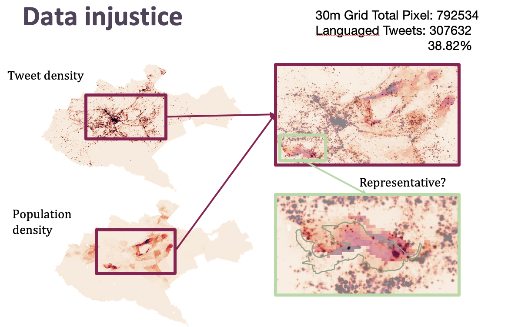
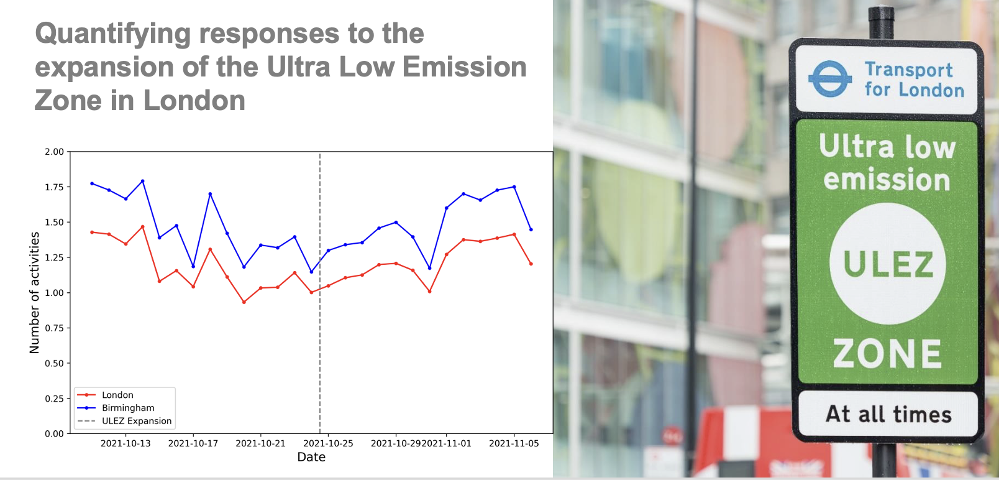
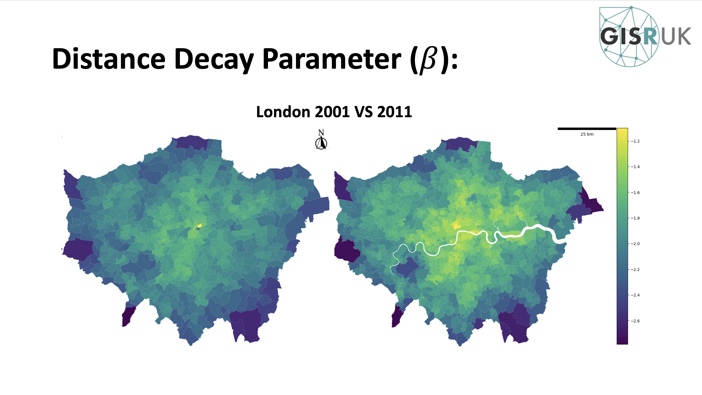
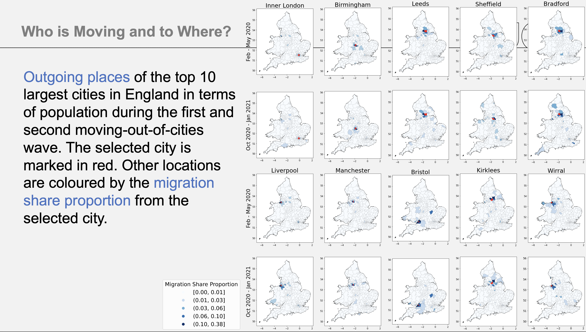
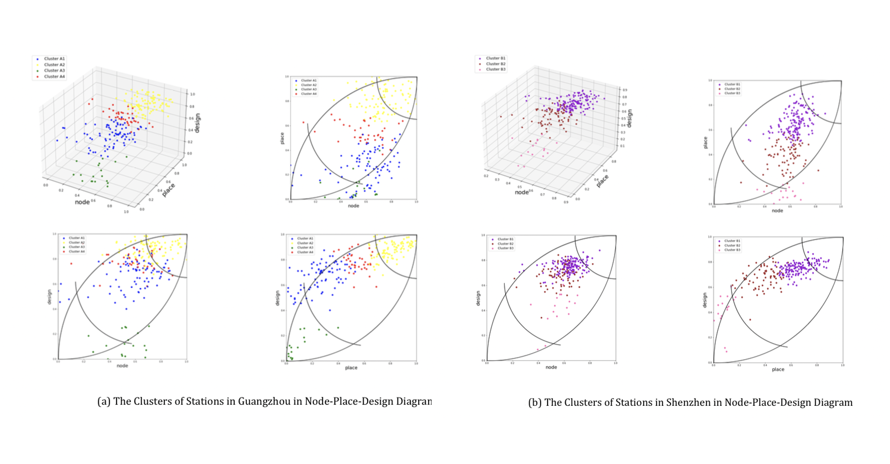

[The 12 International Conference on Geographic Information Science](https://giscience2023.github.io/)

[Title: Digital Injustice: A Case Study of Land Use Classification using Multisource Data in Nairobi, Kenya](https://drops.dagstuhl.de/opus/volltexte/2023/18989/pdf/LIPIcs-GIScience-2023-94.pdf) 

Wenlan Zhang, Dr. Chen Zhong, Dr. Faith Taylor

Keywords: Digital Injustice, Nairobi, Multisource Data, Random Forest

----

[International Conference on Geoinformatics in 2023](https://www.cpgis.org/Conferences/ConferenceDefault.aspx?ID=2079) 

[Title: Quantifying responses to the expansion of the Ultra Low Emission Zone in London](https://www.cpgis.org/userfiles/file/CPGIS_2023_programme_v8.pdf)

Yikang Wang

Keywords: DID model, ULEZ, London, causal inference

----

[GIS Research UK conference 2023](https://gisruk.org/gisruk-2023/) & [ectqg2023](https://ucpages.uc.pt/events/ectqg2023/)

[Title: Exploring the Distance-decay Effect in Commuting Behaviour at the Local-level with a Localised Spatial Interaction Model](https://github.com/c-zhong-ucl-ac-uk/realTRIPS/blob/650900fdab9835bdb80a0938b1e784d9ca352046/publications/GISRUK2023_abstract_bowenzhang.pdf)

Bowen Zhang, Chen Zhong, Qili Gao, Zahratu Shabrina

Keywords: spatial interaction model, commuting behaviour, distance-decay effect

----

[GIS Research UK conference 2023](https://gisruk.org/gisruk-2023/)

[Title: Inferring characteristics of urban structure through the variability in human mobility patterns](https://github.com/c-zhong-ucl-ac-uk/realTRIPS/blob/5668b273df302e20578c5c567213d82bcf2a3092/publications/GISRUK2023_abstract_carmen.pdf)

Carmen Cabrera-Arnau, Chen Zhong, Michael Batty, Ricardo Silva and Soong Moon Kang

Keywords: Urban spatial structure, Smart card data, Polycentricity, Complexity, Mixture models.

----

[The 29th International Conference on Geoinformatics in 2022 and the 30th Anniversary of the Founding of CPGIS](https://www.cpgis.org/conferences/ConferenceDefault.aspx?ID=2078)

[Title: Using Twitter to track internal migration in the UK before and during the COVID-19 pandemic](https://github.com/c-zhong-ucl-ac-uk/realTRIPS/blob/650900fdab9835bdb80a0938b1e784d9ca352046/publications/cpgis2022_abstract_yikang.pdf)

Yikang Wang, Chen Zhong, Carmen Cabrera-Arnau, Qi-Li Gao

Keywords: COVID-19, Twitter data, migration, urban mobility

---

[Hybrid Symposium on Applied Urban Modelling (AUM) 2022](https://www.arct.cam.ac.uk/research/conferences/applied-urban-modelling-aum/aum2022-understanding-common-challenges)

[Title: SIMETRI: Socio-spatial inequalities and human mobility in megacities](https://github.com/c-zhong-ucl-ac-uk/realTRIPS/blob/d6b634799aee2acf5873e751824659676a460f68/publications/AUM_abstract_Qili.pdf)

Qili Gao, Chen Zhong, Yang Yue

Keywords: [SIMETRI](https://simetri.uk/), Megacities, ineqalities, urban mobility

---

[GISRUK 2022 30th Anniversity Conference](http://liverpool.gisruk.org/)

[Title: An analysis of the distribution of urban settlements in Africa](https://github.com/c-zhong-ucl-ac-uk/realTRIPS/blob/3d0102f56a1419293f3994d03dd192c975683d5f/publications/GISRUK_abstract_carmen.pdf)

Carmen Cabrera-Arnau; Rafael Prieto Curiel; Steven Richard Bishop

Keywords: urban scaling, central places, urbanisation in Africa, road network

---

[European Colloquium on Theoretical and Quantitative Geography, ECTQG2021](https://ectqg2021.wordpress.com/)

[Title: How activity pattern associates with income status? Evidence from transit smart card data and AI methods](https://github.com/c-zhong-ucl-ac-uk/realTRIPS/blob/3d0102f56a1419293f3994d03dd192c975683d5f/publications/ECTQG_abstract_qiligao.pdf)

Qi-Li Gao; Chen Zhong; Yang Yue

Keywords: social inequality, socioeconomic status, activity pattern, smart card data, AI.

---

[European Colloquium on Theoretical and Quantitative Geography, ECTQG2021](https://ectqg2021.wordpress.com/)

[Title: A Novel Regionalisation Algorithm for Redrawing Cities’ Functional Boundary within Mega-city Region](https://github.com/c-zhong-ucl-ac-uk/realTRIPS/blob/3d0102f56a1419293f3994d03dd192c975683d5f/publications/ECTQG_abstract_bowenzhang.pdf)

Bowen Zhang; Chen Zhong; Qili Gao

Keywords: urban movements, cell phone data, spatial interaction model, mega city-region

---

[European Colloquium on Theoretical and Quantitative Geography, ECTQG2021](https://ectqg2021.wordpress.com/)

[Title: Measuring the Polycentricity based on urban and intercity transportation networks in Greater Bay Area: a cross-scale method in the context of Node-Place model](https://github.com/c-zhong-ucl-ac-uk/realTRIPS/blob/3d0102f56a1419293f3994d03dd192c975683d5f/publications/ECTQG_abstract_haocheng.pdf)

Haocheng Sun; Michael Batty; Chen Zhong

Keywords: GBA, Spatial Structure, Morphological Polycentricity, Node-Place Model

---

[European Colloquium on Theoretical and Quantitative Geography, ECTQG2021](https://ectqg2021.wordpress.com/)

[Title: The Comparative Study of TOD in Metro Station Areas of Guangzhou and Shenzhen Using an Extended Node-Place Model](https://github.com/c-zhong-ucl-ac-uk/realTRIPS/blob/3d0102f56a1419293f3994d03dd192c975683d5f/publications/ECTQG_abstract_yongxinyang.pdf)

Yongxin Yang;

Keywords: TOD, node-place-design model, urban vibrancy, metro station areas

---

### Latest Blog Posts

<ul class="posts">
  
    <li>{{ post.date | date_to_string }} &raquo; <a href="{{ site.baseurl }}{{ post.url }}">{{ post.title }}</a></li>
  
</ul>
